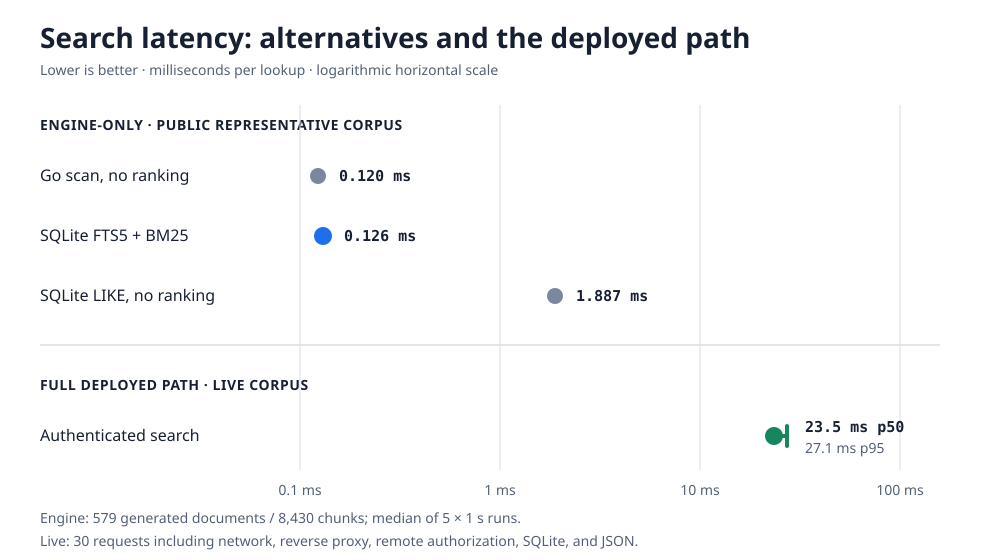

# Knowledge Commons

Knowledge Commons is a small knowledge server for humans and AI agents. One Go binary ingests multilingual Markdown, preserves immutable Git provenance, searches heading-level chunks, and applies identity-aware visibility rules before returning results.

The default deployment is one container with an embedded SQLite database. The interfaces are deliberately narrow so storage and identity providers can evolve without changing how agents publish or retrieve knowledge.

## Features

- One static Go binary and a scratch-based container image
- SQLite FTS5 search with BM25 ranking and heading-level snippets
- English, Vietnamese, Traditional Chinese, and arbitrary language identifiers
- Immutable source URL, revision, path, and content hash on every imported revision
- Idempotent Git/Markdown synchronization with bounded transient retries
- Shared and restricted visibility enforced after identity resolution
- Human-reviewed proposals alongside source-controlled knowledge
- Optional PostgreSQL adapter for the reviewed-knowledge workflow

## Quick start

Go 1.26.5 or newer is required.

```sh
go build -o knowledge-commons ./cmd/knowledge-commons

KC_IDENTITY_PROVIDER=header \
KC_INGEST_SUBJECTS=admin \
KC_RESTRICTED_SUBJECTS=admin \
./knowledge-commons
```

The `header` identity provider is intended for local development only. In another terminal, import a Markdown repository:

```sh
./knowledge-commons source sync \
  --directory ../your-wiki \
  --source handbook \
  --key-prefix handbook \
  --visibility shared \
  --revision "$(git -C ../your-wiki rev-parse HEAD)" \
  --repository-url https://github.com/example/your-wiki \
  --url http://127.0.0.1:8080 \
  --actor admin \
  --language-root en=docs/en
```

Then search it:

```sh
curl -G \
  -H 'X-KC-Actor: reader' \
  --data-urlencode 'q=pressure vessel' \
  --data-urlencode 'language=en' \
  --data-urlencode 'limit=3' \
  http://127.0.0.1:8080/v1/search
```

The container uses `/data/knowledge-commons.db` by default:

```sh
docker build -t knowledge-commons .
docker run --rm -p 8080:8080 \
  -v knowledge-commons-data:/data \
  -e KC_IDENTITY_PROVIDER=header \
  -e KC_INGEST_SUBJECTS=admin \
  -e KC_RESTRICTED_SUBJECTS=admin \
  knowledge-commons
```

## Identity and visibility

`shared` means visible to an authenticated subject; it does not mean public. `restricted` results are returned only when the resolved subject is listed in `KC_RESTRICTED_SUBJECTS`.

Production deployments should use `KC_IDENTITY_PROVIDER=remote` and set `KC_IDENTITY_URL` to an HTTPS endpoint that returns:

```json
{"actor":"assistant","subject":"employee","is_agent":true}
```

Knowledge Commons forwards only `Authorization`, `X-Acts-For`, and `Accept-Language` to that endpoint. Do not expose the development `header` provider to untrusted clients.

## Configuration

| Variable | Default | Purpose |
|---|---|---|
| `KC_HTTP_ADDRESS` | `:8080` | HTTP listen address |
| `KC_IDENTITY_PROVIDER` | `disabled` | `disabled`, `header`, or `remote` |
| `KC_IDENTITY_URL` | — | Remote identity context endpoint |
| `KC_RESTRICTED_SUBJECTS` | — | Subjects allowed to read restricted pages |
| `KC_INGEST_SUBJECTS` | — | Subjects allowed to import source documents |
| `KC_STORAGE_PROVIDER` | `sqlite` | `sqlite` or `postgres` |
| `KC_DATA_PATH` | `./knowledge-commons.db` | SQLite file path |
| `KC_DATABASE_URL` | — | PostgreSQL connection URL |
| `KC_DATABASE_MAX_CONNECTIONS` | `20` | PostgreSQL connection limit |
| `KC_SHUTDOWN_TIMEOUT` | `10s` | Graceful shutdown deadline |

SQLite is the fully exercised source-ingestion path. PostgreSQL currently supports the reviewed-knowledge workflow but does not yet have source-ingestion parity.

## Search latency



| Path | Typical latency | Ranking | Authorization | Durable |
|---|---:|---:|---:|---:|
| Go linear scan | 0.120 ms | No | No | No |
| SQLite FTS5 + BM25 | 0.126 ms | Yes | Visibility filter | Yes |
| SQLite `LIKE` | 1.887 ms | No | Visibility filter | Yes |
| Deployed authenticated search | 23.5 ms p50 / 27.1 ms p95 | Yes | Remote identity policy | Yes |

The engine-only benchmark uses a deterministic public corpus with 579 documents, three languages, and 8,430 heading chunks. The values are median `ns/op` from five one-second runs on an Apple M4 Pro using Go 1.26.5.

The deployed distribution comes from 30 sequential requests and includes the agent process, network, reverse proxy, remote identity resolution, visibility policy, SQLite, and JSON serialization. It is shown separately because it is not equivalent to an engine microbenchmark. FTS5 represents about 0.54% of the deployed median at this corpus size.

Reproduce the engine comparison:

```sh
go test ./internal/storage/sqlite \
  -run '^$' \
  -bench BenchmarkLookupStrategies \
  -benchmem \
  -benchtime=1s \
  -count=5
```

Summary measurements are in [`benchmarks/search-latency.csv`](benchmarks/search-latency.csv), with all five engine runs in [`benchmarks/search-latency-runs.csv`](benchmarks/search-latency-runs.csv).

### Why not another search engine?

| Approach | Good fit | Tradeoff in this project |
|---|---|---|
| In-memory scan | Tiny, read-only collections | No durable index or relevance ranking; memory grows with the corpus |
| SQL `LIKE` | Simple filters and occasional substring checks | No relevance model and 15× slower than FTS5 in this benchmark |
| SQLite FTS5 | Embedded single-node search | Chosen starting point; compact and ranked, but not semantic search |
| PostgreSQL full-text search | Multiple writers and an existing PostgreSQL estate | Additional service and operational overhead |
| Dedicated search service | Large corpora and high query concurrency | Another distributed system to secure and operate |
| Vector or hybrid search | Semantic similarity and paraphrase recall | Requires embedding generation, model/version tracking, and a separate quality evaluation |

PostgreSQL, dedicated search products, and vector databases are not assigned latency numbers here because they were not run on the same hardware, corpus, query, and authorization path. Vendor numbers would not be a fair comparison.

## Status

This is an early working release. The SQLite path, source ingestion, provenance, lexical search, visibility boundary, reviewed workflow, persistence, and container build are tested. Semantic embeddings, clustered replication, automatic Git webhooks, and PostgreSQL ingestion parity remain future work.

## License

Licensed under the [Apache License 2.0](LICENSE).
